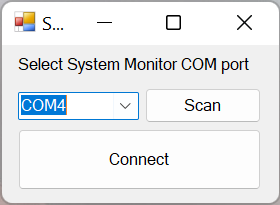
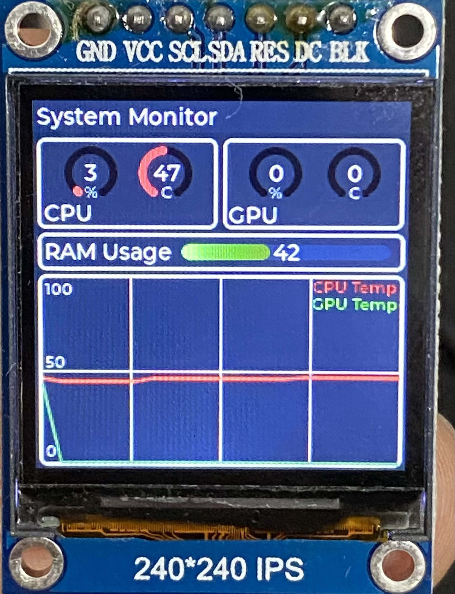

# System Monitor

---

## Description

This aim of this project is to make something to display user status of the pc without having system info overlay on the monitor.

This project is base on STM32F411 driving small LCD to display computer hardware status to user.

Project Links: 

## Specifications

### Hardware

- STM32F411
- ST7789 240*240px 1.3inch LCD

### Software

- LVGL
- FreeRTOS (CMSIS-2 API)
- C# PC software

### Details

PC side software was written in C# winform application. It uses openhardwaremonitor dll to retrieve PC hardware status and send those data to the MCU.  The connection between PC software and MCU was done via USB CDC. Since there is a driver for USB CDC class in window, there is no need to install driver for this to work.

Communication between PC and MCU is simply a USB serial connection. Data frame between PC and MCU is simply hardware readings in hex format.

### Firmware

Firmware was written in C and uses RTOS. With current implementation it is un-necessary to have a RTOS but I find it makes easier for future expansion. 

[**LVGL](https://lvgl.io/) GUI library was used to handle graphic related functions.**

### Software

There is not much to talk about the C# software since it is simply read the PC hardware status through openhardwaremonitor.dll

It is compiled using Visual Studio 2022.

When the PC software was started, user is required to select correct COM port that MCU was assigned to. User can select correct COM port from drop down list. After selecting the right COM port, user can press “Connect” button to start monitoring and sending data to the MCU.

PC software interface

PC software link: 

### Hardware

Connection between MCU and LCD is through SPI connection clocked at 48Mbps (highest speed available on STM32F411 if we wanted to have USB functionality. The LCD being used is 1.3 inch LCD, 240*240px, ST7789 driver IC. It is recommended to get IPS panel due to high viewing angle although it is a bit more expensive. Currently there is no external EEPROM to store GUI. I might add EEPROM later.

System status on LCD

### Ref

ST7789 driver: [https://github.com/Floyd-Fish/ST7789-STM32](https://github.com/Floyd-Fish/ST7789-STM32)